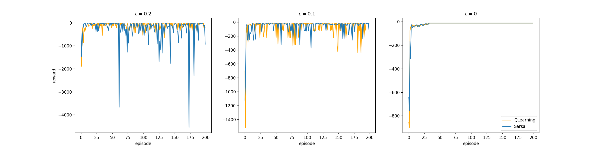

# Reinforcement Learning Assignment 2 - Cliff Walking

## Dependency
- matplotlib
- numpy

## Usage
```bash
python main.py
```

## Result


```
Policy e=0.2 QLearning
> ^ > > > > > > > > > v 
> > > > > > > > > > > v 
> > > > > > > > > > > v 
^ ^ ^ ^ ^ ^ ^ ^ ^ ^ ^ ^ 
Policy e=0.2 Sarsa
> ^ > > > < ^ > > > ^ v 
> v ^ ^ v v < ^ ^ > ^ v 
^ ^ > ^ > > < ^ < > > v 
^ ^ ^ ^ ^ ^ ^ ^ ^ ^ ^ ^ 

Policy e=0.1 QLearning
< > > > > > > > > > > v 
> > > > > > > > > > > v 
> > > > > > > > > > > v 
^ ^ ^ ^ ^ ^ ^ ^ ^ ^ ^ ^ 
Policy e=0.1 Sarsa
v < > ^ > > > > > ^ > v 
> > > > ^ > > ^ > > > v 
> ^ ^ > ^ ^ ^ ^ ^ ^ > v 
^ ^ ^ ^ ^ ^ ^ ^ ^ ^ ^ ^ 

Policy e=0 QLearning
v > ^ > > > > > > > > v 
> v > > > > > > > > > v 
> > > > > > > > > > > v 
^ ^ ^ ^ ^ ^ ^ ^ ^ ^ ^ ^ 
Policy e=0 Sarsa
v > > > > > > > > > > v 
> ^ > > > > > > > > > v 
> > > > > > > > > > > v 
^ ^ ^ ^ ^ ^ ^ ^ ^ ^ ^ ^ 
```

The result shows that QLearning always finds the optimal solution 
with different $\epsilon$ while Sarsa may find some "safe path".

Besides, the algorithm would converge to more stable results with smaller $\epsilon$.
And it may not converge if $\epsilon$ is too large.